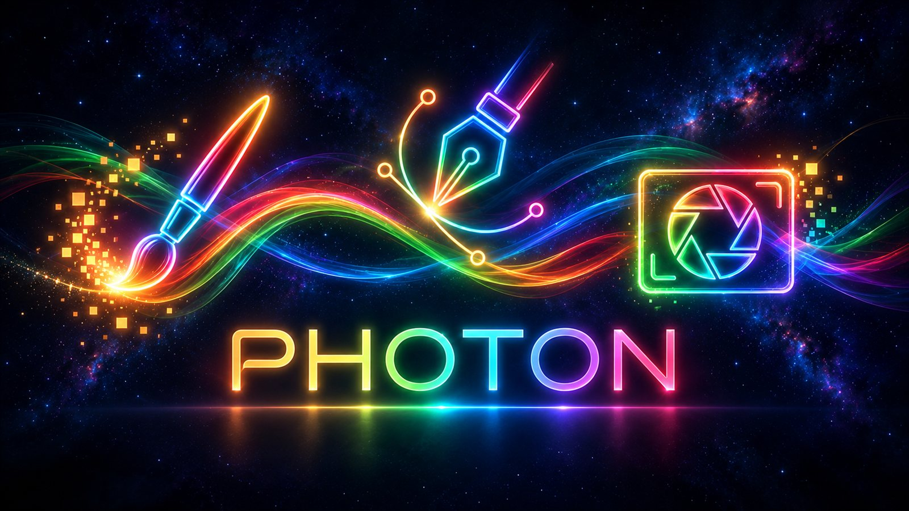
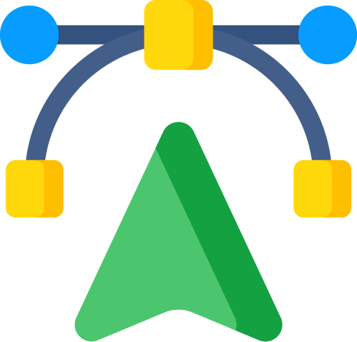
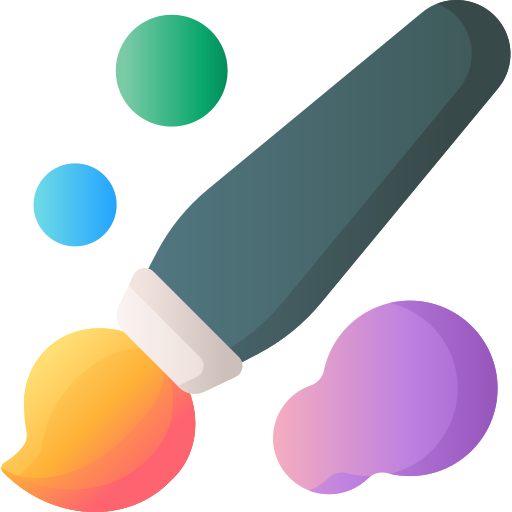
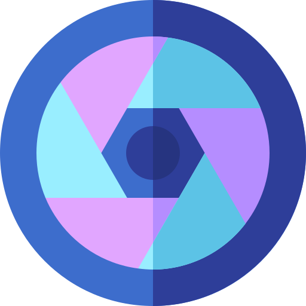
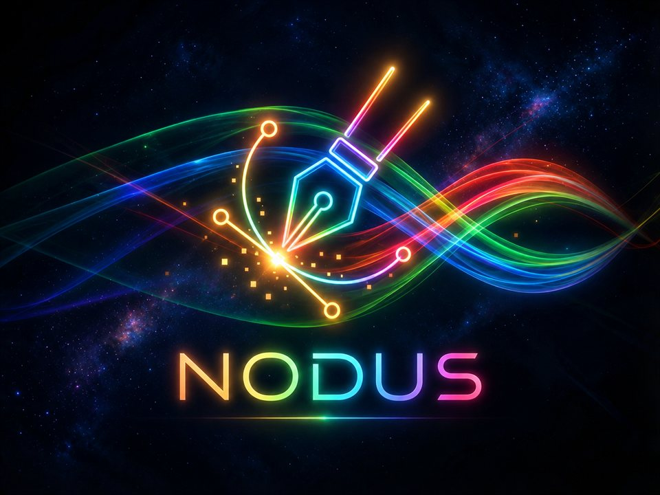
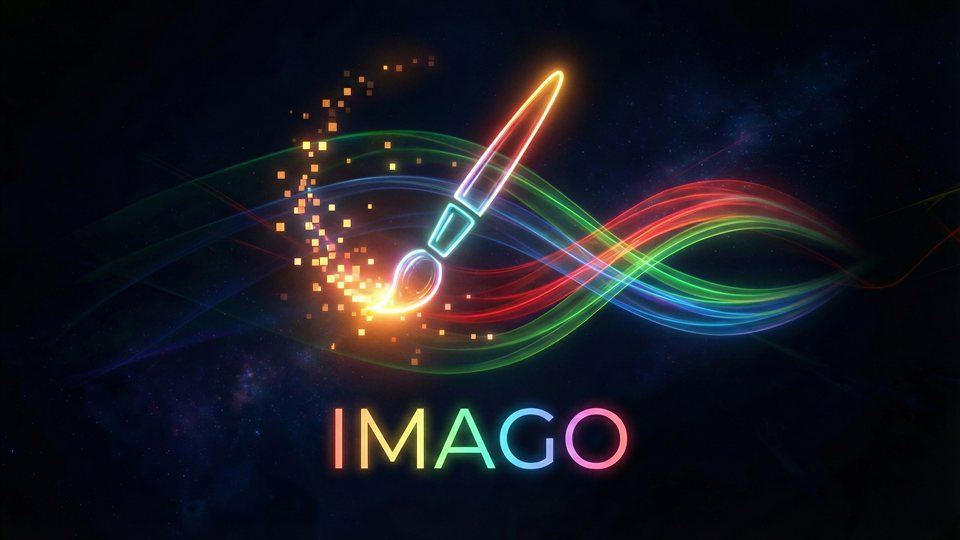
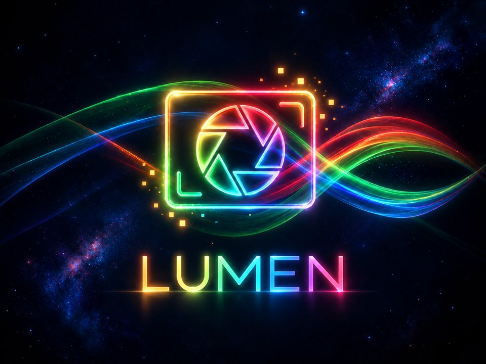
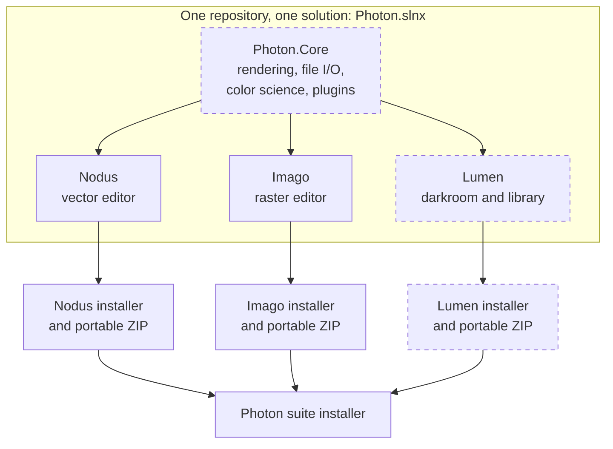

<div align="center">

<a href="https://www.rizonesoft.com">
  <picture>
    <source media="(prefers-color-scheme: dark)" srcset="resources/brand/rizonesoft-logo-light.svg">
    <source media="(prefers-color-scheme: light)" srcset="resources/brand/rizonesoft-logo-dark.svg">
    
  </picture>
</a>

<h1>Photon Graphics Suite</h1>

<p>Three native Windows creative apps, one shared core: a vector editor, a raster editor, and a digital darkroom.<br>Free, open source, and yours to keep.</p>

[](https://github.com/rizonesoft/Photon/actions/workflows/build.yml)
[](https://github.com/rizonesoft/Photon/actions/workflows/plan.yml)
[](https://github.com/rizonesoft/Photon/actions/workflows/release.yml)
[](https://github.com/rizonesoft/Photon/releases)
<br>
[](LICENSE)
[](https://dotnet.microsoft.com/download/dotnet/11.0)
[](https://jrsoftware.org/isinfo.php)
[](#download-and-install)

<br>



</div>

> [!NOTE]
> **Status: pre-alpha.** There is no release yet. Nodus (the vector editor) edits real SVG files today; Imago has its domain model and application shell; Lumen is planned. Everything below marks what works and what is still on the roadmap. Star or watch the repository to hear about the first preview.

## Contents

- [Why Photon](#why-photon)
- [The suite](#the-suite)
- [Features](#features)
- [Architecture](#architecture)
- [Download and install](#download-and-install)
- [Build from source](#build-from-source)
- [Versioning and releases](#versioning-and-releases)
- [Roadmap](#roadmap)
- [Contributing](#contributing)
- [License](#license)
- [Acknowledgements](#acknowledgements)

## Why Photon

Professional graphics software has drifted toward subscriptions, sign-ins, and cloud lock-in. Photon goes the other way.

- **Own your tools.** No account, no subscription, no telemetry required to open a file.
- **Native and fast.** Built for Windows on .NET 11, WPF, and SkiaSharp, with startup time and responsiveness treated as features.
- **Open formats first.** SVG, PNG, TIFF, and JPEG are first-class citizens, with import paths for the formats you already have.
- **One family, three tools.** Each app installs and updates on its own, yet they share a core so colors, rendering, and plugins behave the same everywhere.
- **Free software.** GPL-3.0, developed in the open.

## The suite

<table>
  <tr>
    <th width="33%">
      <br>
      Rizonesoft Nodus
    </th>
    <th width="33%">
      <br>
      Rizonesoft Imago
    </th>
    <th width="33%">
      <br>
      Rizonesoft Lumen
    </th>
  </tr>
  <tr>
    <td></td>
    <td></td>
    <td></td>
  </tr>
  <tr>
    <td><strong>Vector editor.</strong> Structure and design: precision illustration, typography, logos, scalable graphics. An Illustrator alternative.</td>
    <td><strong>Raster editor.</strong> Creation and manipulation: painting, retouching, layer composition, pixel-level editing. A Photoshop alternative.</td>
    <td><strong>Digital darkroom and asset manager.</strong> RAW development, non-destructive edits, batch adjustments, library management. A Lightroom alternative.</td>
  </tr>
  <tr>
    <td>Targets <code>.svg</code>, <code>.eps</code>, <code>.ai</code>, <code>.pdf</code></td>
    <td>Targets <code>.psd</code>, <code>.png</code>, <code>.tiff</code>, <code>.jpg</code></td>
    <td>Camera RAW in, hands off to Imago</td>
  </tr>
  <tr>
    <td>🟢 <strong>Working prototype</strong><br>SVG editing works today</td>
    <td>🟡 <strong>Early foundation</strong><br>Domain model and shell</td>
    <td>⚪ <strong>Planned</strong><br>Not started</td>
  </tr>
</table>

<sub>The images above are brand artwork, not screenshots. Real screenshots arrive with the first preview builds.</sub>

## Features

Legend: ✅ works today · 🚧 in progress · 📋 planned

### Nodus (vector)

Nodus began life as the Bezier project and was imported here with its full history. It is the most complete app in the suite.

| Area | Status | Notes |
| ---- | :----: | ----- |
| SVG import and export | ✅ | Open, edit, and save SVG documents |
| Drawing tools | ✅ | Pen (Bezier curves), line, rectangle, ellipse, text |
| Editing tools | ✅ | Select, node edit, pan, zoom |
| Layers | ✅ | Layer panel with ordering |
| Undo and redo | ✅ | Command-based history (move, resize, rotate, scale, group, reorder, property edits) |
| Alignment and snapping | ✅ | Align selections, snap while drawing |
| Raw SVG view | ✅ | Inspect and edit the markup directly |
| EPS, AI, and PDF import and export | 📋 | Target formats, not yet implemented |
| Move to shared Photon.Core | 📋 | Rendering and file I/O to migrate into the core |

### Imago (raster)

| Area | Status | Notes |
| ---- | :----: | ----- |
| Domain model | 🚧 | Documents, layers, masks, selections, tiles, history, color types |
| Application shell | 🚧 | WPF window, menus, and docking panels |
| Tiled rendering pipeline | 📋 | Designed for very large images |
| Painting and retouching tools | 📋 | Brush, eraser, selection, clone |
| Filters and adjustment layers | 📋 | Non-destructive by design |
| PNG, JPEG, TIFF, PSD | 📋 | Target formats |
| Plugins and scripting | 📋 | Plugin abstractions exist; runtime to come |

### Lumen (darkroom)

| Area | Status | Notes |
| ---- | :----: | ----- |
| RAW decoding and development | 📋 | Non-destructive processing |
| Library and catalog | 📋 | Import, browse, rate, tag |
| Batch adjustments | 📋 | Apply settings across a selection |
| Edit in Imago | 📋 | Send a developed image straight to Imago |

## Architecture

Photon follows one rule: **develop together, distribute separately.** All three apps live in one repository and one solution so shared code can be refactored in a single change and debugged end to end. Each app is still compiled into its own self-contained directory with its own copy of the core, so updating Imago can never break an installed Nodus.



<sub>Dashed boxes are planned. Today Nodus lives in <code>src/Nodus/</code> and Imago in <code>src/Imago/</code>; shared code moves into Photon.Core as the apps converge.</sub>

**Shared core responsibilities (planned):**

- **Rendering pipeline:** high-performance 2D drawing primitives on SkiaSharp.
- **File I/O:** one place for complex format readers and writers.
- **Color science:** shared color management so a color looks the same in Nodus, Imago, and Lumen.
- **Plugin system:** a common interface so filters and brushes can work across apps.

<details>
<summary><strong>Technology stack</strong></summary>

| Piece | Choice |
| ----- | ------ |
| Runtime | .NET 11 (SDK pinned to 11.0.100-rc.1 until .NET 11 ships in November 2026) |
| UI | WPF with standard controls (no third-party UI framework) |
| Rendering | SkiaSharp |
| MVVM | CommunityToolkit.Mvvm |
| Logging | Serilog |
| Tests | xUnit v3, AwesomeAssertions |
| Installers | Inno Setup 7 (64-bit Setup), self-contained .NET |
| Versioning | MinVer, from Git tags |
| Platform | Windows 11, x64 (Windows 10 22H2 best-effort, unsupported) |

</details>

<details>
<summary><strong>Repository layout</strong></summary>

| Path | What it holds |
| ---- | ------------- |
| `src/Nodus/` | The Nodus vector editor (imported from the Bezier project) |
| `src/Imago/` | The Imago raster editor |
| `src/Lumen/` | Lumen (planned) |
| `docs/` | User and developer documentation ([index](docs/README.md)) |
| `todo/` | The development plan and TODO tree ([implementation plan](todo/implementation-plan.md)) |
| `installer/` | Inno Setup scripts, one per app plus the suite |
| `scripts/` | Build, check, and packaging scripts |
| `tools/` | Toolchain provisioning and Git hooks |
| `resources/` | Brand art, icons, and shared assets |

</details>

## Download and install

> [!IMPORTANT]
> No builds have been published yet. This section describes how releases will ship; the first preview will appear on the [Releases](https://github.com/rizonesoft/Photon/releases) page.

Every app ships on its own, in two forms:

| Form | Best for | Notes |
| ---- | -------- | ----- |
| **Installer** (`.exe`, Inno Setup) | Most people | Start menu entry and a clean uninstall |
| **Portable ZIP** | Locked-down machines, trying it out | Unzip and run, no installer needed |
| **Suite installer** | Getting everything at once | One Photon Graphics Suite installer with a component per app (Nodus and Imago today) |

**Per-user or all-users.** The installer asks at startup. A per-user install needs no administrator rights and lands in your profile; an all-users install needs elevation and lands in Program Files.

**No .NET install needed.** Every build is self-contained, so the right .NET runtime travels with the app.

**Requirements:** Windows 11 (23H2 or later), 64-bit (x64). Windows 10 22H2 may work but is unsupported: .NET 11 does not support consumer Windows 10, and the installer says so before it continues.

**Package managers:** winget packages are planned after the first stable release.

## Build from source

<details open>
<summary><strong>Prerequisites</strong></summary>

- Windows 11 (23H2 or later), x64. Windows 10 22H2 may work but is unsupported.
- [PowerShell 7](https://learn.microsoft.com/powershell/scripting/install/installing-powershell-on-windows) (`pwsh`)
- [Git](https://git-scm.com/)
- .NET SDK **11.0.100-rc.1.26425.128** (the .NET 11 release candidate), pinned in `global.json`. The provisioning script installs it for you.
- Optional: [Inno Setup 7.1](https://jrsoftware.org/isinfo.php) or newer to build installers locally (the provisioning script installs it)

</details>

```powershell
git clone https://github.com/rizonesoft/Photon.git
cd Photon

pwsh tools/provision.ps1          # install the pinned .NET SDK and tools
dotnet build Photon.slnx          # build every app
pwsh scripts/check-all.ps1        # run every gate: build, tests, analyzers, plan checks
pwsh scripts/package.ps1 -App Nodus   # produce the Nodus installer and portable ZIP
```

To run Nodus straight from source:

```powershell
dotnet run --project src/Nodus/Bezier.Desktop
```

Full details, including troubleshooting and CI, live in [docs/dev/build.md](docs/dev/build.md).

## Versioning and releases

Each app is versioned independently with [Semantic Versioning](https://semver.org/). Versions come from Git tags through [MinVer](https://github.com/adamralph/minver), so there is no version number to edit by hand.

| Tag | Releases |
| --- | -------- |
| `nodus-vX.Y.Z` | Nodus |
| `imago-vX.Y.Z` | Imago |
| `lumen-vX.Y.Z` | Lumen |
| `photon-vX.Y.Z` | The suite installer |

Pushing a tag builds, packages, and publishes that app's installer and portable ZIP. Changes are recorded per app in [CHANGELOG.md](CHANGELOG.md). See [docs/dev/versioning.md](docs/dev/versioning.md) for the full scheme.

## Roadmap

Development is driven by a TODO tree in [`todo/`](todo/), with the ordered plan in [todo/implementation-plan.md](todo/implementation-plan.md). In broad strokes:

1. **Foundation:** one solution, shared build infrastructure, CI, installers, and release automation.
2. **Nodus preview:** stabilize the vector editor and ship the first public build.
3. **Nodus parity:** bring Nodus to parity with Adobe Illustrator 30.8 and CorelDRAW Graphics Suite 2026 (v27.2), every feature of both, in ten releases from 0.2.0 to 1.0.0. The [parity catalog](docs/parity/nodus-parity.md) routes each of their 4,335 inventory rows to a planned section, an existing one, the backlog, an exclusion (scripting, cloud services), or another Photon app. Nodus AI runs on OpenRouter with your own API key (BYOK), sends nothing without an explicit action, and rests on three pillars: results are editable, undoable vector objects; brand kits and hand-offs work across the suite; and every AI action is recorded so it can be re-run, compared, and reverted.
4. **Photon.Core:** the shared library grows the pixel engine, color management, and the AI core with the Nodus parity work, the pixel engine extensions and the develop engine with the Imago parity work, and takes rendering, file I/O, and other code as a second app needs it.
5. **Imago preview:** canvas, layers, core tools, and PNG, JPEG, and TIFF support in `imago-v0.1.0`.
6. **Imago parity:** bring Imago to parity with Adobe Photoshop 27.10 (with Camera Raw 18.6) and two other popular raster editors, Affinity by Canva 3.3 (Affinity Photo) and GIMP 3.2.6, every feature of all three, in twelve releases from 0.2.0 to 1.0.0 (Phases 16 to 27 of the plan). The [Imago parity catalog](docs/parity/imago-parity.md) routes each of their 10,829 inventory rows to a planned section, an existing one, the backlog, an exclusion (cloud services, platform-only and vendor-removed features), or another Photon app. Imago AI rests on the same three pillars as Nodus AI. Scripting and macros (one suite-wide system), batch processing, video, and animation are deferred to after the first release.
7. **Lumen:** library, RAW development on the suite develop engine, and the Edit in Imago handoff.

The plan file is the source of truth; this list is a summary and may lag behind it.

## Contributing

Contributions are welcome, from bug reports to pull requests.

- Read [CONTRIBUTING.md](CONTRIBUTING.md) for the workflow, commit style, and sign-off terms.
- Report bugs and request features through [Issues](https://github.com/rizonesoft/Photon/issues/new/choose).
- Ask questions and share ideas in [Discussions](https://github.com/rizonesoft/Photon/discussions).
- Report security problems privately, as described in [SECURITY.md](SECURITY.md).
- Everyone taking part follows the [Code of Conduct](CODE_OF_CONDUCT.md).

More documentation: [docs/](docs/README.md) · [user guides](docs/user/README.md) · [developer guides](docs/dev/README.md).

## License

Copyright (C) 2025-2026 Rizonesoft

The Photon Graphics Suite is free software: you can redistribute it and/or modify it under the terms of the **GNU General Public License version 3** as published by the Free Software Foundation. It is distributed in the hope that it will be useful, but without any warranty. See [LICENSE](LICENSE) for the full text.

Nodus and Imago were previously published under the MIT License as separate projects by the same author. Both are now part of this repository and are licensed under GPL-3.0.

## Acknowledgements

Photon stands on the shoulders of excellent open source work:

- [SkiaSharp](https://github.com/mono/SkiaSharp) and [Skia](https://skia.org/) for 2D rendering
- [SharpVectors](https://github.com/ElinamLLC/SharpVectors) for the Nodus splash logo
- [CommunityToolkit.Mvvm](https://github.com/CommunityToolkit/dotnet) for MVVM source generators
- [Serilog](https://serilog.net/) for structured logging
- [AvalonDock](https://github.com/Dirkster99/AvalonDock) for docking panels
- [MinVer](https://github.com/adamralph/minver) for tag-based versioning
- [Inno Setup](https://jrsoftware.org/isinfo.php) for installers
- [xUnit](https://xunit.net/) and [AwesomeAssertions](https://awesomeassertions.org/) for testing

<div align="center">
<sub>Made in the open by <a href="https://www.rizonesoft.com">Rizonesoft</a>.</sub>
</div>
