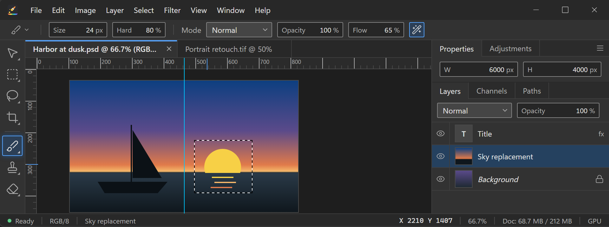
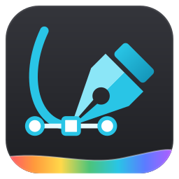
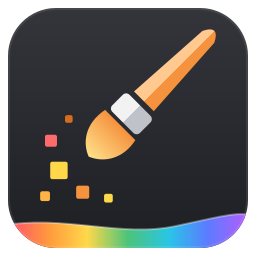
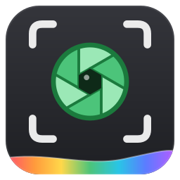
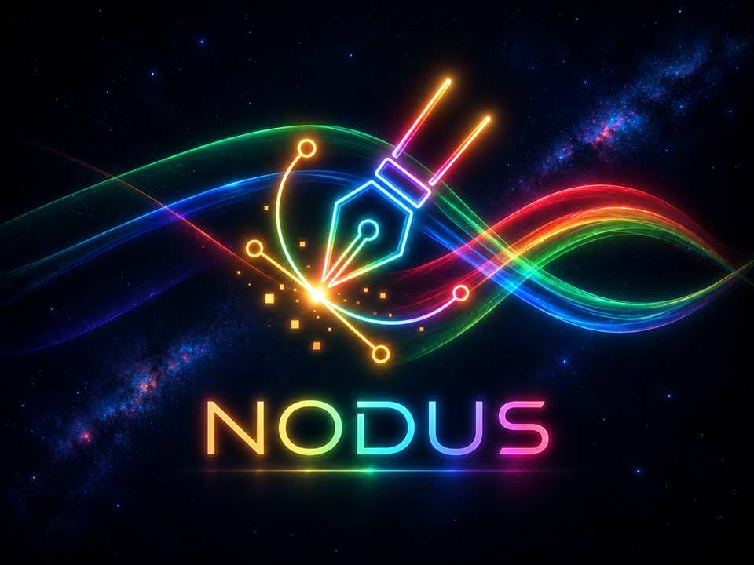
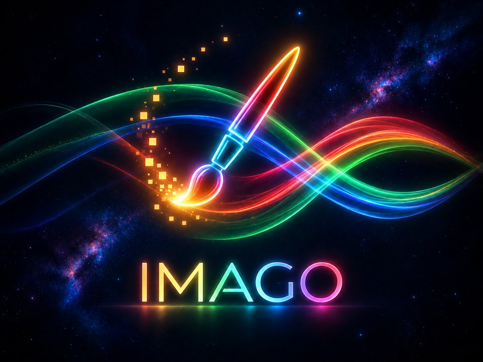
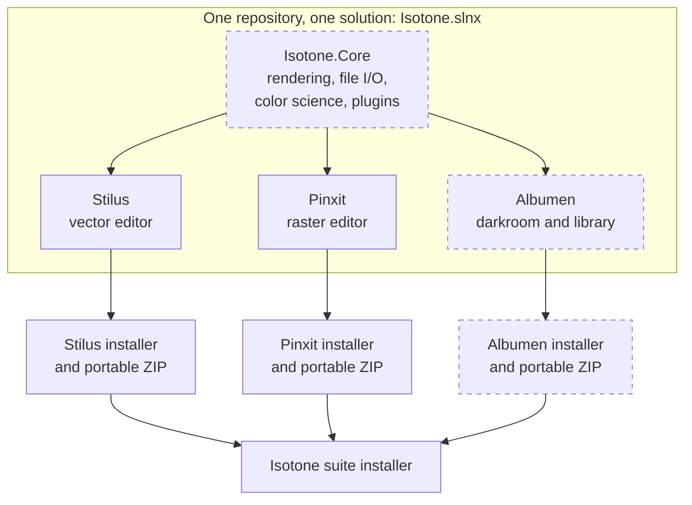

<div align="center">

<a href="https://www.rizonesoft.com/?utm_source=github&utm_medium=readme-logo">
  <picture>
    <source media="(prefers-color-scheme: dark)" srcset="resources/brand/rizonesoft-logo-light.svg">
    <source media="(prefers-color-scheme: light)" srcset="resources/brand/rizonesoft-logo-dark.svg">
    
  </picture>
</a>

<h1>Isotone Graphics Suite</h1>

<p>Three native Windows creative apps, one shared core: a vector editor, a raster editor, and a digital darkroom.<br>Free, open source, and yours to keep.</p>

[](https://github.com/rizonesoft/Isotone/actions/workflows/build.yml)
[](https://github.com/rizonesoft/Isotone/actions/workflows/plan.yml)
[](https://github.com/rizonesoft/Isotone/actions/workflows/release.yml)
[](https://github.com/rizonesoft/Isotone/releases)
[](https://www.rizonesoft.com/?utm_source=github&utm_medium=readme-badge)
<br>
[](LICENSE)
[](https://dotnet.microsoft.com/download/dotnet/11.0)
[](https://jrsoftware.org/isinfo.php)
[](#download-and-install)

<br>



<sub><i>Design concept, not a screenshot: the target interface from the Isotone Interface design system. The apps do not look like this yet; each surface is built to this design as its plan section ships.</i></sub>

</div>

**Design:** [Isotone Interface design system: themes, controls, and app icons](https://rizonesoft.github.io/Isotone/design/), a live page generated from [`docs/design/`](docs/design/README.md).

> [!NOTE]
> **Status: pre-alpha.** There is no release yet. Stilus (the vector editor) edits real SVG files today; Pinxit has its domain model and application shell; Albumen is planned. Everything below marks what works and what is still on the roadmap. Star or watch the repository to hear about the first preview.

## Contents

- [Why Isotone](#why-isotone)
- [The suite](#the-suite)
- [Features](#features)
- [Architecture](#architecture)
- [Download and install](#download-and-install)
- [Build from source](#build-from-source)
- [Versioning and releases](#versioning-and-releases)
- [Roadmap](#roadmap)
- [Contributing](#contributing)
- [License](#license)
- [Acknowledgements](#acknowledgements)

## Why Isotone

Professional graphics software has drifted toward subscriptions, sign-ins, and cloud lock-in. Isotone goes the other way.

- **Own your tools.** No account, no subscription, no telemetry required to open a file.
- **Native and fast.** Built for Windows on .NET 11, WPF, and SkiaSharp, with startup time and responsiveness treated as features.
- **Open formats first.** SVG, PNG, TIFF, and JPEG are first-class citizens, with import paths for the formats you already have.
- **One family, three tools.** Each app installs and updates on its own, yet they share a core so colors, rendering, and plugins behave the same everywhere.
- **Free software.** GPL-3.0, developed in the open.

## The suite

<table>
  <tr>
    <th width="33%">
      <br>
      Rizonesoft Stilus
    </th>
    <th width="33%">
      <br>
      Rizonesoft Pinxit
    </th>
    <th width="33%">
      <br>
      Rizonesoft Albumen
    </th>
  </tr>
  <tr>
    <td></td>
    <td></td>
    <td></td>
  </tr>
  <tr>
    <td><strong>Vector editor.</strong> Structure and design: precision illustration, typography, logos, scalable graphics. An Illustrator alternative.</td>
    <td><strong>Raster editor.</strong> Creation and manipulation: painting, retouching, layer composition, pixel-level editing. A Photoshop alternative.</td>
    <td><strong>Digital darkroom and asset manager.</strong> RAW development, non-destructive edits, batch adjustments, library management. A Lightroom alternative.</td>
  </tr>
  <tr>
    <td>Targets <code>.svg</code>, <code>.eps</code>, <code>.ai</code>, <code>.pdf</code></td>
    <td>Targets <code>.psd</code>, <code>.png</code>, <code>.tiff</code>, <code>.jpg</code></td>
    <td>Camera RAW in, hands off to Pinxit</td>
  </tr>
  <tr>
    <td>🟢 <strong>Working prototype</strong><br>SVG editing works today</td>
    <td>🟡 <strong>Early foundation</strong><br>Domain model and shell</td>
    <td>⚪ <strong>Planned</strong><br>Not started</td>
  </tr>
</table>

<sub>The images above are brand artwork, not screenshots. Real screenshots arrive with the first preview builds.</sub>

## Features

Legend: ✅ works today · 🚧 in progress · 📋 planned

### Stilus (vector)

Stilus began life as the Bezier project and was imported here with its full history. It is the most complete app in the suite.

| Area | Status | Notes |
| ---- | :----: | ----- |
| SVG import and export | ✅ | Open, edit, and save SVG documents |
| Drawing tools | ✅ | Pen (Bezier curves), line, rectangle, ellipse, text |
| Editing tools | ✅ | Select, node edit, pan, zoom |
| Layers | ✅ | Layer panel with ordering |
| Undo and redo | ✅ | Command-based history (move, resize, rotate, scale, group, reorder, property edits) |
| Alignment and snapping | ✅ | Align selections, snap while drawing |
| Raw SVG view | ✅ | Inspect and edit the markup directly |
| EPS, AI, and PDF import and export | 📋 | Target formats, not yet implemented |
| Move to shared Isotone.Core | 📋 | Rendering and file I/O to migrate into the core |

### Pinxit (raster)

| Area | Status | Notes |
| ---- | :----: | ----- |
| Domain model | 🚧 | Documents, layers, masks, selections, tiles, history, color types |
| Application shell | 🚧 | WPF window, menus, and docking panels |
| Tiled rendering pipeline | 📋 | Designed for very large images |
| Painting and retouching tools | 📋 | Brush, eraser, selection, clone |
| Filters and adjustment layers | 📋 | Non-destructive by design |
| PNG, JPEG, TIFF, PSD | 📋 | Target formats |
| Plugins and scripting | 📋 | Plugin abstractions exist; runtime to come |

### Albumen (darkroom)

| Area | Status | Notes |
| ---- | :----: | ----- |
| RAW decoding and development | 📋 | Non-destructive processing |
| Library and catalog | 📋 | Import, browse, rate, tag |
| Batch adjustments | 📋 | Apply settings across a selection |
| Edit in Pinxit | 📋 | Send a developed image straight to Pinxit |

## Architecture

Isotone follows one rule: **develop together, distribute separately.** All three apps live in one repository and one solution so shared code can be refactored in a single change and debugged end to end. Each app is still compiled into its own self-contained directory with its own copy of the core, so updating Pinxit can never break an installed Stilus.



<sub>Dashed boxes are planned. Today Stilus lives in <code>src/Stilus/</code> and Pinxit in <code>src/Pinxit/</code>; shared code moves into Isotone.Core as the apps converge.</sub>

**Shared core responsibilities (planned):**

- **Rendering pipeline:** high-performance 2D drawing primitives on SkiaSharp.
- **File I/O:** one place for complex format readers and writers.
- **Color science:** shared color management so a color looks the same in Stilus, Pinxit, and Albumen.
- **Plugin system:** a common interface so filters and brushes can work across apps.

<details>
<summary><strong>Technology stack</strong></summary>

| Piece | Choice |
| ----- | ------ |
| Runtime | .NET 11 (SDK pinned to 11.0.100-rc.1 until .NET 11 ships in November 2026) |
| UI | WPF with standard controls (no third-party UI framework) |
| Rendering | SkiaSharp |
| MVVM | CommunityToolkit.Mvvm |
| Logging | Serilog |
| Tests | xUnit v3, AwesomeAssertions |
| Installers | Inno Setup 7 (64-bit Setup), self-contained .NET |
| Versioning | MinVer, from Git tags |
| Platform | Windows 11, x64 (Windows 10 22H2 best-effort, unsupported) |

</details>

<details>
<summary><strong>Repository layout</strong></summary>

| Path | What it holds |
| ---- | ------------- |
| `src/Stilus/` | The Stilus vector editor (imported from the Bezier project) |
| `src/Pinxit/` | The Pinxit raster editor |
| `src/Albumen/` | Albumen (planned) |
| `docs/` | User and developer documentation ([index](docs/README.md)) |
| `todo/` | The development plan and TODO tree ([implementation plan](todo/implementation-plan.md)) |
| `installer/` | Inno Setup scripts, one per app plus the suite |
| `scripts/` | Build, check, and packaging scripts |
| `tools/` | Toolchain provisioning and Git hooks |
| `resources/` | Brand art, icons, and shared assets |

</details>

## Download and install

> [!IMPORTANT]
> No builds have been published yet. This section describes how releases will ship.

**Download from [rizonesoft.com](https://www.rizonesoft.com/?utm_source=github&utm_medium=readme-download).** Installers and portable ZIPs are published only there, served from `download.rizonesoft.com`, never attached to GitHub. Each [GitHub release](https://github.com/rizonesoft/Isotone/releases) carries the release notes, the source code of that tag, the SHA-256 checksums, and links to the files on `download.rizonesoft.com`, so you can check what you downloaded. Once the first release exists, its files live at `https://download.rizonesoft.com/<app>/<version>/` (for example `https://download.rizonesoft.com/stilus/0.1.0/`).

Every app ships on its own, in two forms:

| Form | Best for | Notes |
| ---- | -------- | ----- |
| **Installer** (`.exe`, Inno Setup) | Most people | Start menu entry and a clean uninstall |
| **Portable ZIP** | Locked-down machines, trying it out | Unzip and run, no installer needed |
| **Suite installer** | Getting everything at once | One Isotone Graphics Suite installer with a component per app (Stilus and Pinxit today) |

**Per-user or all-users.** The installer asks at startup. A per-user install needs no administrator rights and lands in your profile; an all-users install needs elevation and lands in Program Files.

**No .NET install needed.** Every build is self-contained, so the right .NET runtime travels with the app.

**Requirements:** Windows 11 (23H2 or later), 64-bit (x64). Windows 10 22H2 may work but is unsupported: .NET 11 does not support consumer Windows 10, and the installer says so before it continues.

**Package managers:** winget packages are planned after the first stable release; their manifests will point at `download.rizonesoft.com`.

## Build from source

<details open>
<summary><strong>Prerequisites</strong></summary>

- Windows 11 (23H2 or later), x64. Windows 10 22H2 may work but is unsupported.
- [PowerShell 7](https://learn.microsoft.com/powershell/scripting/install/installing-powershell-on-windows) (`pwsh`)
- [Git](https://git-scm.com/)
- .NET SDK **11.0.100-rc.1.26425.128** (the .NET 11 release candidate), pinned in `global.json`. The provisioning script installs it for you.
- Optional: [Inno Setup 7.1](https://jrsoftware.org/isinfo.php) or newer to build installers locally (the provisioning script installs it)

</details>

```powershell
git clone https://github.com/rizonesoft/Isotone.git
cd Isotone

pwsh tools/provision.ps1          # install the pinned .NET SDK and tools
dotnet build Isotone.slnx          # build every app
pwsh scripts/check-all.ps1        # run every gate: build, tests, analyzers, plan checks
pwsh scripts/package.ps1 -App Stilus   # produce the Stilus installer and portable ZIP
```

To run Stilus straight from source:

```powershell
dotnet run --project src/Stilus/Bezier.Desktop
```

Full details, including troubleshooting and CI, live in [docs/dev/build.md](docs/dev/build.md).

## Versioning and releases

Each app is versioned independently with [Semantic Versioning](https://semver.org/). Versions come from Git tags through [MinVer](https://github.com/adamralph/minver), so there is no version number to edit by hand.

| Tag | Releases |
| --- | -------- |
| `stilus-vX.Y.Z` | Stilus |
| `pinxit-vX.Y.Z` | Pinxit |
| `albumen-vX.Y.Z` | Albumen |
| `isotone-vX.Y.Z` | The suite installer |

Pushing a tag builds and packages that app's installer and portable ZIP, uploads them to `download.rizonesoft.com`, and publishes a GitHub release with the notes, checksums, and download links. Changes are recorded per app in [CHANGELOG.md](CHANGELOG.md). See [docs/dev/versioning.md](docs/dev/versioning.md) for the full scheme.

## Roadmap

Development is driven by a TODO tree in [`todo/`](todo/), with the ordered plan in [todo/implementation-plan.md](todo/implementation-plan.md). In broad strokes:

1. **Foundation:** one solution, shared build infrastructure, CI, installers, and release automation.
2. **Stilus preview:** stabilize the vector editor and ship the first public build.
3. **Stilus parity:** bring Stilus to parity with Adobe Illustrator 30.8 and CorelDRAW Graphics Suite 2026 (v27.2), every feature of both, in ten releases from 0.2.0 to 1.0.0. The [parity catalog](docs/parity/stilus-parity.md) routes each of their 4,335 inventory rows to a planned section, an existing one, the backlog, an exclusion (scripting, cloud services), or another Isotone app. Stilus AI runs on OpenRouter with your own API key (BYOK), sends nothing without an explicit action, and rests on three pillars: results are editable, undoable vector objects; brand kits and hand-offs work across the suite; and every AI action is recorded so it can be re-run, compared, and reverted.
4. **Isotone.Core:** the shared library grows the pixel engine, color management, and the AI core with the Stilus parity work, the pixel engine extensions and the develop engine with the Pinxit parity work, and takes rendering, file I/O, and other code as a second app needs it.
5. **Pinxit preview:** canvas, layers, core tools, and PNG, JPEG, and TIFF support in `pinxit-v0.1.0`.
6. **Pinxit parity:** bring Pinxit to parity with Adobe Photoshop 27.10 (with Camera Raw 18.6) and two other popular raster editors, Affinity by Canva 3.3 (Affinity Photo) and GIMP 3.2.6, every feature of all three, in twelve releases from 0.2.0 to 1.0.0 (Phases 16 to 27 of the plan). The [Pinxit parity catalog](docs/parity/pinxit-parity.md) routes each of their 10,829 inventory rows to a planned section, an existing one, the backlog, an exclusion (cloud services, platform-only and vendor-removed features), or another Isotone app. Pinxit AI rests on the same three pillars as Stilus AI. Scripting and macros (one suite-wide system), batch processing, video, and animation are deferred to after the first release.
7. **Albumen preview:** library, RAW development on the suite develop engine, and the Edit in Pinxit handoff in `albumen-v0.1.0`.
8. **Albumen parity:** bring Albumen to parity with Adobe Lightroom Classic 15.5.1, ACDSee Photo Studio Ultimate 2027, and IrfanView 4.76, in ten releases from 0.2.0 to 1.0.0 (Phases 30 to 39 of the plan), on three pillars: a fast default image viewer (`AlbumenViewer.exe`, opening any image from Explorer within a recorded startup budget), browsing any folder without importing it, and batch rename, convert, resize, edit, develop, and export as core tools. The [Albumen parity catalog](docs/parity/albumen-parity.md) routes each of their 8,919 inventory rows to a planned section, an existing one, the backlog, an exclusion (cloud services), or another Isotone app (ACDSee's layered Edit mode goes to Pinxit). Originals are safe by default: Albumen writes into an original only when you opt in, and then only after a verified backup. Faces are recognized on your machine and never sent anywhere; tethered capture is replaced by watched-folder import for now.
9. **Distribution:** signing, win-arm64, winget, and the first suite bundle, `isotone-v1.0.0`.

The plan file is the source of truth; this list is a summary and may lag behind it.

## Contributing

Contributions are welcome, from bug reports to pull requests.

- Read [CONTRIBUTING.md](CONTRIBUTING.md) for the workflow, commit style, and sign-off terms.
- The names and icons are covered by the [trademark policy](TRADEMARKS.md): a modified version you distribute needs its own name and icons.
- Report bugs and request features through [Issues](https://github.com/rizonesoft/Isotone/issues/new/choose).
- Ask questions and share ideas in [Discussions](https://github.com/rizonesoft/Isotone/discussions).
- Report security problems privately, as described in [SECURITY.md](SECURITY.md).
- Everyone taking part follows the [Code of Conduct](CODE_OF_CONDUCT.md).
- UI work follows [standards/ui.md](standards/ui.md) and the [Isotone Interface design system page](https://rizonesoft.github.io/Isotone/design/) (source: [`docs/design/`](docs/design/README.md)).

More documentation: [docs/](docs/README.md) · [user guides](docs/user/README.md) · [developer guides](docs/dev/README.md).

## License

Copyright (C) 2025-2026 Rizonetech (Pty) Ltd

Rizonesoft is a brand of Rizonetech (Pty) Ltd.

The Isotone Graphics Suite is free software: you can redistribute it and/or modify it under the terms of the **GNU General Public License version 3** as published by the Free Software Foundation. It is distributed in the hope that it will be useful, but without any warranty. See [LICENSE](LICENSE) for the full text. The GPL covers the code; the names "Rizonesoft", "Isotone Graphics Suite", "Stilus", "Pinxit", and "Albumen" and the app icons are trademarks of Rizonetech (Pty) Ltd, covered by the [trademark policy](TRADEMARKS.md).

Stilus and Pinxit were previously published under the MIT License as separate projects by the same author. Both are now part of this repository and are licensed under GPL-3.0.

## Acknowledgements

Isotone stands on the shoulders of excellent open source work:

- [SkiaSharp](https://github.com/mono/SkiaSharp) and [Skia](https://skia.org/) for 2D rendering
- [SharpVectors](https://github.com/ElinamLLC/SharpVectors) for the Stilus splash logo
- [CommunityToolkit.Mvvm](https://github.com/CommunityToolkit/dotnet) for MVVM source generators
- [Serilog](https://serilog.net/) for structured logging
- [AvalonDock](https://github.com/Dirkster99/AvalonDock) for docking panels
- [MinVer](https://github.com/adamralph/minver) for tag-based versioning
- [Inno Setup](https://jrsoftware.org/isinfo.php) for installers
- [xUnit](https://xunit.net/) and [AwesomeAssertions](https://awesomeassertions.org/) for testing

<div align="center">
<sub>Made in the open by <a href="https://www.rizonesoft.com/?utm_source=github&utm_medium=readme-footer">Rizonesoft</a>, a brand of Rizonetech (Pty) Ltd.</sub>
</div>
